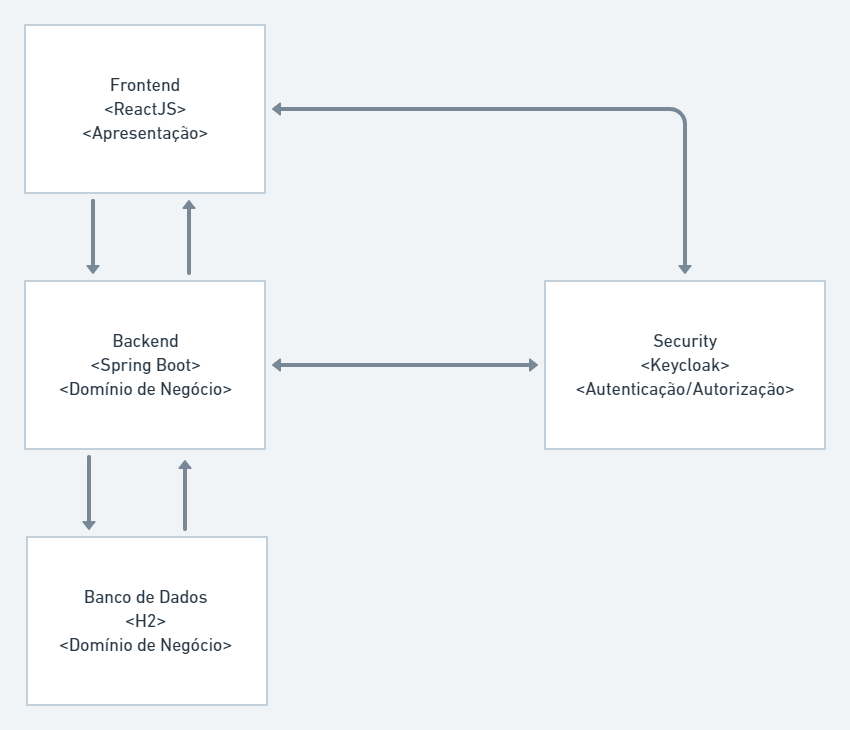

# Projeto final de aplicação módulo 3

## Requisitos
- Faça o clone deste repositório
- OpenJDK 11
- Node 12+

## Processo automatizado

- Acesse a raiz do repositorio e execute o comando ``docker-compose up``.
-- Este comando será responsável por buildar e criar as imagens necessárias e rodar para acesso.
- Os dados de acesso estão disponíveis no tópico *Utilização final*.

## Processo manual
### Backend
- Acesse a pasta do backend e execute o comando ``mvn clean package install`` para que o arquivo JAR seja gerado.
- Ainda na pasta backend, crie a imagem docker para poder executar juntamente com o docker-compose da raiz, que sobe o projeto completo (front e backend) ou somente o backend(docker-compose na pasta backend).
-- Para criar a imagem do docker, dentro de backend, execute o comando ``docker image build -t backend:0.0.1-SNAPSHOT .``.

### Frontend
- Acesse a pasta do frontend dentro do repositório e crie a imagem docker executando o comando ``docker image build --network host -t frontend:0.1.0 .``.

## Utilização final
- Na raiz do repositório, execute o comando ``docker-compose up`` para que as imagens sejam executadas e disponibilizem o projeto para acesso.
-- Usuário do sistema: bezos
-- Senha do usuário do sistema: 123456

### Arquitetura da aplicação

# Demais informações do projeto

## Descrição

Você está participando de um processo seletivo para ingressar numa vaga de programador
**full stack** em uma grande empresa de TI. E como etapa final deste processo seletivo você deverá documentar a **API REST**, criar um diagrama de camadas de aplicação e *dockerizar* o módulo de **Frontend** e **Backend** feitos na etapa anterior deste processo (**#Projeto 6**).

## Funcionalidades

* Deverá ser documentada a **API REST** do Backend feita no **#Projeto 6**;
* Dockerizar o Frontend feito no **#Projeto 6**; 
* Dockerizar o Backend feito no **#Projeto 6**;
* Criar um diagrama de integrações dos sistemas feitos até está etapa do processo, contendo as camadas de  apresentação, negócio, segurança e persistência.

## Requisitos

* 1 - Ultilização do docker no projeto de **Frontend**, realizando todas as instalações de dependências necessárias para o projeto;
* 2 - Ultilização do docker no projeto de **Backend**, realizando todas as instalações de dependências necessárias para o projeto;
* 3 - Documentação de API no modelo de arquiterura REST;
* 4 - Diagramas de integrações de aplicações contendo as camadas de  apresentação, negócio, segurança e persistência;

## Instruções para a avaliação

* Fork esse repositório e faça o desafio numa branch se organizando com seu grupo;
* Assim que o grupo concluir o seu desafio, encaminhe o link dos repositórios no **AVA** até a data de **26/08 as 18:00**;
* Todos deverão participar da apresentação do projeto que tem tempo máximo de 15
  minutos;
* Realize a apresentação de acordo com os requisitos solicitados neste projeto;

OBS: Para visualizar os critérios de aceite deste projeto veja [AQUI](./criterios-de-aceite.md).
